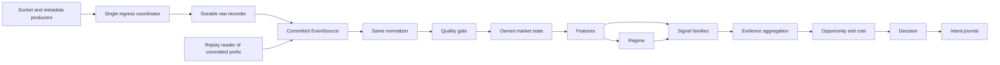

# Architecture and contracts

Design target: Go, one instrument in V0, extensible only behind explicit contracts. Schema sketches below are normative field semantics, not a request to implement the engine now. See [SPEC](SPEC.md) for governing invariants and [PLAN](PLAN.md) for version scope.

## Flow and dependency direction



`internal/domain` defines immutable values and interfaces. Adapters (`internal/source/coinbase`, `internal/source/replay`, storage, telemetry) depend inward. The analysis packages depend on domain types and their own pure inputs; they must not import adapters, disk, WebSocket, wall-clock, or repository-wide mutable globals. V0 stops after ordered normalization, quality, and book state/replay comparison; V1 adds the analytical path.

## Canonical event model

The single ingress coordinator is the **capture linearization point**. It assigns a strictly increasing `Ordinal` per run when it accepts one observed frame or control event. Source producers stamp `ReceiveTime` at observation and send immutable messages to this coordinator; `AdmissionTime` is stamped on acceptance. The coordinator may admit a tick ahead of a frame read earlier but queued later. That frame keeps its earlier receipt timestamp but is usable only from its later admission ordinal/time. Per-connection frame and disconnect order is preserved by one socket producer. One observation produces one `RawRecord`:

```text
RawRecord v1 {
  run_id, ordinal, source_id, connection_epoch, kind,
  receive_time, admission_time, usable_from_time, monotonic_elapsed_ns,
  payload_bytes (exact WebSocket UTF-8 frame, or typed control payload),
  payload_sha256, schema_version
}
kind = WS_FRAME | CONNECTED | DISCONNECTED | CLOCK_TICK |
       METADATA_REQUEST | METADATA_RESPONSE | SOURCE_ERROR |
       CLOCK_ANOMALY | WATCHDOG_INCIDENT | CAPTURE_GAP | SHUTDOWN
```

Record the `subscriptions` acknowledgment once as its original `WS_FRAME`; normalization derives `SourceStatus(subscribed)` at that ordinal. An epoch increments at each connection attempt. A monotonic ticker produces observations at one-second intervals; the coordinator admits and records them in queue order. A tick's `tick_time` is its **logical admission time**, while its generator wall time remains `receive_time`; these may differ under backlog. `UsableFromTime = max(AdmissionTime, prior UsableFromTime)` within a healthy run. Exchange/producer observation time never moves the state backward. `monotonic_elapsed_ns` is relative to run start and used for operational clock/lag checks, not as an exchange timestamp. Raw records are immutable; corrupt or uncommitted suffixes are excluded with an explicit recovery report.

Normalization produces `Event` values with common fields `{schema_version, run_id, ordinal, venue, instrument, source_id, connection_epoch, kind, event_time?, publication_time?, receive_time, admission_time, usable_from_time, quality_flags, raw_ref}`. `raw_ref` contains segment ID and record ordinal/hash. Persist normalized records as UTF-8 JSONL with lower-case `snake_case` keys in lexicographic order, one compact object and newline per derived event, ordered by raw ordinal; an unknown raw frame yields no normalized market event but remains in the raw log. UTC instants use RFC3339 with up to nine fractional digits; an absent time is JSON `null`. Ordinals, sequence numbers, and trade IDs serialize as base-10 strings to avoid downstream JSON integer precision loss. Decimal values serialize as normalized base-10 strings without exponent notation. V0 event kinds:

- `BookSnapshot`: complete bid/ask price-level arrays; `EventTime = null` because the exchange snapshot message documents no time field.
- `BookDelta`: ordered list of `(side, price, absolute_size)`; `EventTime` from source `time`.
- `Heartbeat`: source sequence and last trade ID as **diagnostic metadata**; `EventTime` from source `time`.
- `SourceStatus`: connected, subscribed, disconnected, error, capture gap, shutdown with reason/epoch.
- `ClockTick`: recorded logical tick time.
- `ProductMetadata`: public GET response and request/response timestamps; available only from response admission. The startup request itself is raw control evidence and creates no product state.

Variant payload keys are `bids` and `asks` arrays of `[price,size]` for `BookSnapshot`; `changes` array of `[side,price,absolute_size]` for `BookDelta`; `sequence` and `last_trade_id` for `Heartbeat`; `state` and `reason` for `SourceStatus`; `tick_time` for `ClockTick`; and `product_id`, `status`, `trading_disabled`, `request_time`, `response_time` plus the exact response reference for `ProductMetadata`. `side` is `buy`/`sell` exactly as documented for book levels. The normalizer maps source-native names to these canonical keys; it does not synthesize missing market data.

Unknown WebSocket message types remain in raw storage, increment an unknown-type metric, and do not mutate market state or invalidate an otherwise valid epoch; the protocol explicitly permits new types. Malformed required fields produce a quality event, never a partly populated market event. Parse price/size strings exactly with at most 18 integer and 18 fractional digits, no exponent, and no binary float for book identity. Reject nonpositive prices and negative sizes. Preserve source order within a multi-change message. In V0, instrument is `coinbase-exchange:BTC-USD`; do not assume asset ticker alone is globally unique. Future event types (trades, candles, funding, publications) must declare source-native time semantics and versions before admission.

## Source and engine interfaces

The interfaces express ownership; exact Go spelling is decided at implementation without changing behavior:

```go
type EventSource interface {
    Next(ctx context.Context) (RawRecord, error)
}
type AnalysisEngine interface {
    Apply(Event) ([]AnalysisOutput, error) // deterministic, serial call order
    Close() error
}
```

`LiveSource` owns network reads and stamps completed frames. Its ingress coordinator assigns ordinals; the recorder wrapper commits raw records and implements `EventSource.Next` by returning only committed records. `ReplaySource` also implements `EventSource.Next`, reading already numbered, validated raw records in ordinal order; it does not re-record, renumber, decode, or precompute features. Both enter the same normalizer/quality/state path after raw persistence. The replay source is forbidden from fetching live data or making historical range queries. The engine receives only individual admitted events and an injected logical clock represented by `ClockTick`; it cannot access a future iterator. Engine outputs are immutable values written by a separate sink. `io.EOF` means the end of the requested committed prefix; the run manifest/recovery report separately says whether the live run ended cleanly. A malformed or missing committed record is an error, not end-of-stream.

## V0 capture, replay, and clock contract

First public feed: Coinbase Exchange `wss://ws-feed.exchange.coinbase.com`, unauthenticated subscription to `level2` and `heartbeat` for `BTC-USD`. The public endpoint, subscription protocol, and per-product sequence behavior are documented in [Exchange WebSocket Overview](https://docs.cdp.coinbase.com/exchange/websocket-feed/overview). Level 2 supplies a complete `snapshot` and subsequent `l2update`s; update size is absolute and zero deletes the level, per [Exchange WebSocket Channels](https://docs.cdp.coinbase.com/exchange/websocket-feed/channels). The heartbeat is sent about once per second and includes a last trade ID. The [product endpoint](https://docs.cdp.coinbase.com/api-reference/exchange-api/rest-api/products/get-single-product) identifies BTC-USD and its metadata. At startup, record a public `METADATA_REQUEST`, perform the GET, then record `METADATA_RESPONSE` with exact response bytes and observation/admission times **before opening the WebSocket**. Require `id=BTC-USD` and `status=online`; reject `trading_disabled=true` when that optional field is present, and retain its absence as unknown provenance rather than inventing `false`. A missing/error/offline response prevents subscription. The manifest indexes metadata records but is never a market-state side input; later refreshes, if added, must be ordered response events too.

V0 deliberately excludes matches/trades, REST book bootstrap, candles, L3, derivatives, and multiple instruments. The Level 2 channel already sends its own snapshot; a REST snapshot would introduce a second synchronization protocol. The heartbeat validates feed liveness, not Level 2 completeness. Sequence numbers from heartbeat are **not** treated as contiguous Level 2 update IDs: the subscribed feed filters message types, and Level 2 messages shown in the official schema have no sequence field. The source's stated Level 2 delivery guarantee applies only to an intact connection; any disconnect, unreadable frame, recorder overflow, or parser failure invalidates the book and requires a new snapshot. Silent provider-side omissions that preserve a healthy connection cannot be proven absent by V0; this residual risk is recorded, not concealed.

Replay order is recorder ordinal, never exchange or receive timestamp. A frame read before a tick but admitted after it cannot affect that tick's state. `UsableFromTime = max(AdmissionTime, prior UsableFromTime)`; the coordinator also enforces nondecreasing admission time. Compare UTC wall elapsed with process monotonic elapsed at each ingress observation. If their discrepancy exceeds two seconds, record `CLOCK_ANOMALY`, close the operational output gate, terminate the run, and never clear that run's time health. A new run may start only after ten consecutive one-second monotonic observations with wall/monotonic elapsed disagreement at most two seconds, then a new metadata response and fresh book snapshot. The new run has a new UTC/monotonic anchor and explicit `CAPTURE_GAP`; it does not inherit the future-clamped logical time. These thresholds are V0 operational assumptions, not assertions of absolute UTC accuracy. For any output at T, every contributing raw reference has `UsableFromTime <= T` and lower/equal ordinal than the triggering record. A tick at the same time as a market frame observes only preceding ordinals. Playback speed (fast, paced, step) changes wall-clock duration only, not event sequence or canonical state. A bounded replay ends at its last committed record; it never invents ticks or completes an unclean run.

Raw storage v1 is append-only and uncompressed. Each segment begins with ASCII `TS3RAW1\n`. Each frame is `[u32be body_length][u32be header_length][header UTF-8 bytes][payload bytes][u32be CRC32C]`; `body_length` counts all bytes after itself, including the trailing CRC. CRC32C (Castagnoli) covers header length, header, and payload. A frame header has `record_type=event` with a `RawRecord`, or `record_type=commit` with `last_ordinal` and a SHA-256 prefix digest; commit frames have empty payload and **no analytical ordinal**. Header/control JSON is compact with lexicographically sorted keys and fixed string encodings for IDs, ordinals, and timestamps. `WS_FRAME` payload is the exact source frame bytes. Reject an event over the configured maximum (default 64 MiB) and fail closed. Finalized segments record SHA-256 of all bytes including preamble/framing; the manifest indexes segments but is not the commit authority. `input_prefix_hash` is streaming SHA-256 of framed **event** bytes through the as-of ordinal, excluding segment preambles and commit frames.

The writer batches at most 100 ms or 1,024 events, then (1) writes event frames and fsyncs, (2) appends a commit frame for that prefix and fsyncs, and only then (3) forwards those events in ordinal order. Recovery accepts only the last structurally valid commit frame whose digest matches the event prefix. A complete frame after that marker is an **uncommitted suffix**, never replay input; a complete marker that survived a process crash is safe to honor because preceding event bytes were fsynced before it was written. A missing final segment manifest does not erase committed data; recovery rebuilds the manifest and marks the run incomplete. Rotate only after a commit, at 256 MiB or a UTC hour boundary. Segment names carry run ID and increasing index. A torn record, CRC failure, digest failure, ordinal gap, or trailing uncommitted frames are reported and excluded, never silently repaired. A fatal disk/recorder failure closes intake and output; the next run begins with `CAPTURE_GAP` after storage restoration and a fresh snapshot.

Keep a separate append-only progress journal keyed by run and ordinal: after state application, record `applied_ordinal`, state hash, and actual UTC/monotonic apply time; after the output sink durably writes the corresponding public quality/book output, record `published_ordinal` and actual publication time. Each journal boundary is fsynced before exposing that output to a reader. These are **contiguous acknowledged prefixes** with `published <= applied <= committed`. Use monotonic elapsed times for within-run causal ordering when small UTC corrections occur; retain UTC stamps for audit. Recovery reports all three high-water marks plus any uncertain suffix. It compares live and replay hashes only through the common acknowledged applied prefix. Replay may process a later committed suffix as a **research continuation**, but must label it as never proven live-applied or published. V0 has no intents; later intent IDs must be deterministic from run/ordinal/model version and publication idempotent. Normalized JSONL is a regenerable derivative and never a source of market side inputs.

Connection behavior: after the ordered metadata response is accepted, open one socket/epoch and send the unauthenticated subscription within five seconds. Require a `subscriptions` acknowledgment within ten seconds that lists **exactly** `level2:BTC-USD` and `heartbeat:BTC-USD`, each once, with no other channel/product. A duplicate or mismatched acknowledgment invalidates that epoch. Require a fresh `snapshot` within ten further seconds. Every heartbeat, snapshot, and delta must contain `product_id=BTC-USD`; a wrong/missing product or required field invalidates the epoch and never mutates the book. A snapshot before verified acknowledgment is invalid, not an implicit acknowledgment. Unknown *new* message types are recorded and ignored, as the source protocol permits them. On transport error, timeout, explicit source error, or required-field failure, the socket producer sends its final frames then a close barrier through the same ordered handoff. The coordinator admits/commits that barrier and closes epoch A before it authorizes epoch B; no two sockets feed one V0 instrument concurrently. State transitions carry epoch ID and affect state only when it matches the active epoch. A late old-epoch frame/status is quarantined and counted, never applied to a new generation. Retry recoverable source failures with exponential backoff from one to 30 seconds and bounded ±20% jitter; replay uses recorded epoch/status events and never reruns jitter. A recorder/storage failure is fatal to the current run and requires a new gap-marked run after recovery.

A reconnect starts `RECOVERING` with no book. A current-epoch acknowledgment, fresh snapshot, and heartbeat are required before `HEALTHY`; no previous epoch's book carries over. A second snapshot within an epoch atomically replaces the book and increments generation. On clean shutdown, stop intake, admit `SHUTDOWN` after the socket close barrier, commit/drain all queues, fsync progress/output journals and manifest, and report all three high-water marks. On forced termination, recovery keeps only the committed prefix, reports any unapplied/unpublished suffix, marks the run incomplete, and inserts a gap in the next run. It cannot pretend to reconstruct missing events.

Book reconstruction: the state owner holds maps from exact decimal price to absolute size for bids/asks. Decimal identity ignores redundant trailing zeroes (`1.0` and `1.00` are one level). **Prevalidate the entire snapshot before replacing state:** at most 250,000 levels per side; each tuple exactly two strings; positive bounded price and strictly positive bounded size; unique canonical price within each side; no empty side; and `best_bid < best_ask`. Reject zero-size levels, even identical duplicates, over-scale values, and contradictory duplicates atomically. A rejected snapshot leaves the previous generation's bytes unchanged but makes it unavailable and forces a new epoch/snapshot; it cannot leave the old generation `HEALTHY`. Prevalidate a whole delta's tuples and bounds before applying any change; then apply in listed order, with zero deleting a level (absent-level zero is counted as a no-op) and nonzero replacing its absolute size. After the delta, reject empty/crossed books and require a fresh snapshot. Record generation, update ordinal, top-of-book and a stable sorted book hash for replay comparison. The hash is SHA-256 of UTF-8 lines `bid,<canonical-price>,<canonical-size>\n` for bids descending, then `ask,...\n` for asks ascending; canonical decimals have no redundant trailing zeroes or exponent. A heartbeat keeps connection health current but does not extend quote freshness.

Initial quality states per instrument/feed are `STARTING`, `HEALTHY`, `DEGRADED`, `UNHEALTHY`, `RECOVERING`. Book-ready requires current-epoch verified acknowledgment, valid snapshot, valid online product metadata already admitted, intact recording, uncrossed book, and recent heartbeat. Analytical heartbeat age is measured from the last heartbeat's `UsableFromTime` to the current admitted tick; over three seconds gives `UNHEALTHY`. Book-update age over 30 seconds gives `DEGRADED` as an activity warning, not proof of a lost update. Both ages reset only from current-generation inputs. Future feature, cost, and intent records must each identify input generation and maximum allowed quote age; absent or exceeded cost-quote freshness forces `NO_TRADE` regardless of overall health. Record clock anomalies, exchange timestamp anomalies, unknown message counts, invalid decimals, reconnects, snapshot wait, capture/admission/commit/apply/publication lag, raw queue fill, fsync latency, book spread/crossed counts, tick lag, and raw/normalized throughput. Thresholds are versioned assumptions, not tuned on the final test set.

## Later analytical modules

`MarketState` is an owned incremental view keyed by venue/instrument/feed and as-of ordinal. It exposes read-only snapshots to feature calculators, never mutable map references. Features declare input feeds/generation, lookback in *available-time* terms, maximum staleness, warm-up, missing-data behavior, units, version, and mechanism. Bars are constructed from admitted events and finalized only after their close boundary is observed by a recorded tick; no final OHLCV value leaks into an in-progress bar. A late event may create a new immutable bar revision with its own availability ordinal, but earlier revisions and outputs remain unchanged. Prediction windows use revisions available as of the prediction ordinal; a final-value export cannot substitute for an as-of query or count old and new revisions twice.

`RegimeEngine` initially uses robust realized-volatility/trend/liquidity summaries with explicit unknown dimensions. `Signal` modules return a typed unavailable result or a prediction with direction, horizon, gross-return distribution summary and feature provenance; calibration is a separate versioned component. `Ensemble` records family-level disagreement and dependence; it may abstain and must not double-count related evidence. `OpportunityModel` uses current-generation spread/depth, a required maximum quote age, fee and slippage assumptions, latency, volatility and uncertainty to compute a bounded net-opportunity estimate. Unknown or stale cost inputs cannot become zero costs. `DecisionEngine` applies predeclared health, calibration, disagreement, regime, and margin-of-safety gates, emitting a reasoned `NO_TRADE` or directional intent. These are target contracts, not claims of validated models.

`TradeIntent v1` is `{intent_id, run_id, as_of_time, as_of_ordinal, decision_ready_at, published_at, earliest_hypothetical_entry_at, venue, instrument, action, horizon, expires_at, quote_generation, quote_as_of_ordinal, quote_age, direction_score?, p_net_positive?, p_move_exceeds_friction?, expected_gross_return?, expected_cost?, expected_net_return?, uncertainty?, supporting_feature_refs, signal_family_outputs, disagreement, regime, health, reason_codes, code_revision, config_hash, input_prefix_hash, model_versions}`. `as_of_time` is logical market information time, never a fill timestamp. `decision_ready_at` and `published_at` are measured live operational times retained in the output journal; replay does not overwrite them with replay processing speed. `earliest_hypothetical_entry_at` is at least `published_at` plus a predeclared nonnegative latency, with the first subsequent healthy side-specific quote determining a hypothetical fill observation. For offline research without live publication, use a separately declared conservative latency model and never label it a measured live fill. `input_prefix_hash` is the committed raw-input prefix hash through `as_of_ordinal`. Probability fields are absent unless calibrated and documented. Return units and horizon are explicit. Cost estimates use a predeclared reference notional, not account sizing. `SHORT` is a bearish analytical intent; the BTC-USD spot data source alone does not establish a shorting mechanism. Without a hypothetical short-feasibility and borrow/carry-cost assumption, a bearish forecast resolves to `NO_TRADE` with `SHORT_FEASIBILITY_UNKNOWN`. No quantity, leverage, order type, account ID, or execution endpoint is allowed.

## Ownership, shutdown, and observability

One goroutine owns the active socket and sends frames then its close barrier in order. A separate tick producer and the metadata fetcher send immutable observations to the **single ingress coordinator**, which owns admission order/epoch lifecycle; only it authorizes the next socket. One recorder goroutine owns raw file writes and commit frames. One deterministic state/engine goroutine owns quality, book, features and decisions for the V0 shard. No shared mutable book, caches, or output slices cross these boundaries. The coordinator's bounded input channel has default capacity 8,192; a producer unable to hand off for one second triggers fail-closed disconnect/run termination, not silent dropping. The writer's 100 ms/1,024-event batch bound is a target; exceeding one second of commit or state lag terminates capture. These operational thresholds are versioned V0 assumptions and must be measured in the soak.

An independent monotonic watchdog keeps the **operational availability gate closed during startup**, arms only after the first applied tick and a `HEALTHY` book, and checks last applied tick and last applied/published progress at least every 250 ms. If either is more than two seconds old, or an ingress/recorder/state handoff exceeds its one-second deadline, it immediately closes the atomic gate consulted at every live health/intent read or publication and terminates that run. No cached directional intent may be served. The watchdog sends `WATCHDOG_INCIDENT` to ingress if storage can still commit it; otherwise the next run's `CAPTURE_GAP` reports the undurable incident interval. The gate never reopens within the failed run; a new run needs fresh metadata, subscription, snapshot, heartbeat and tick progress. Prompt wall-time suppression is an operational fact, not a replay-derived market signal. Replay reproduces committed incident transitions and common-prefix analytical state; its speed does not prove that the live gate closed on time. Record time-to-gate-close and any interval with no durable incident because storage failed.

Telemetry receives copies and cannot mutate analytical state. `context.Context` cancels intake; supervised errors distinguish recoverable source failures from fatal recorder, clock, ownership, or state failures. Shutdown order is socket intake/close barrier → ingress → recorder/commit → normalizer/state/progress journal → output journal/manifest. Backpressure blocks briefly or fails closed. Coinbase [WebSocket best practices](https://docs.cdp.coinbase.com/exchange/websocket-feed/best-practices) warn about slow-consumer disconnections and recommend light receive callbacks, so queue pressure is a quality boundary. Future cross-market joins require an explicit global arrival-order/coordinator contract before admitting a second feed. Metrics and logs include epoch and ordinal with bounded label cardinality.

## Initial package/directory layout

```text
cmd/collector/              V0 capture CLI
cmd/replay/                 V0 replay/verify CLI
internal/domain/            event, decimal, time and health contracts
internal/source/coinbase/   public WebSocket adapter only
internal/source/replay/     ordered raw-reader adapter
internal/record/            segment writer, reader, manifest, integrity
internal/ingress/           single coordinator, epoch and clock boundaries
internal/progress/          applied/published journals and recovery report
internal/watchdog/          monotonic live availability gate
internal/normalize/         source frame to canonical event
internal/quality/           connection, clock, schema, staleness rules
internal/book/              single-owner Level 2 state and stable hash
internal/engine/            V1+ analytical orchestrator
internal/feature/           V1+ feature implementations
internal/regime/            V1+ regime estimates
internal/signal/            V1+ independent families
internal/opportunity/       V1+ friction and opportunity
internal/decision/          V1+ intent policy
internal/telemetry/         metrics and structured logs
testdata/                   synthetic raw tapes and expected outputs
docs/                       specification and research record
```

Do not create empty V1+ packages in V0 merely to match this target tree.
