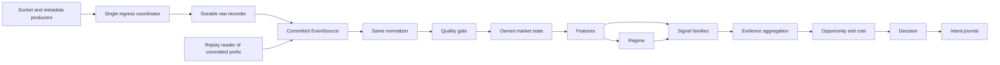

# Architecture and contracts

Go implementation: V0 and V1 are accepted on `main`; V2 develops on `v2`. The frozen V1 tick-driven engine remains the benchmark. V2's planned single-feed owner path and separate evidence/intent schema are in [V2_DESIGN](V2_DESIGN.md). See [SPEC](SPEC.md) for governing invariants and [PLAN](PLAN.md) for milestone scope.

## Flow and dependency direction



`internal/domain` defines immutable values and interfaces. Adapters (`internal/source/kraken`, `internal/source/wsclient`, `internal/source/replay`, storage, telemetry) depend inward. The analysis packages depend on domain types and their own pure inputs; they must not import adapters, disk, WebSocket, wall-clock, or repository-wide mutable globals. V0 stops after ordered normalization, quality, and book state/replay comparison; V1 adds the tick-driven baseline specified in [V1_DESIGN](V1_DESIGN.md).

## Canonical event model

The single ingress coordinator is the capture linearization point. It assigns a strictly increasing run `Ordinal` when accepting one immutable observation. Producers stamp `ReceiveTime` immediately after a complete frame read; the coordinator stamps the actual UTC `AdmissionTime`. `UsableFromTime = max(AdmissionTime, prior UsableFromTime)` and is nondecreasing even across small wall-clock corrections. A read-completed frame overtaken by a tick remains later by ordinal and cannot alter the earlier tick. The coordinator enforces connection epochs and a committed disconnect barrier before the next connection is authorized.

`RawRecord v1` contains `{run_id, ordinal, source_id, connection_epoch, kind, receive_time, admission_time, usable_from_time, monotonic_elapsed_ns, payload_sha256, schema_version}` plus exact payload bytes. Kinds are `WS_FRAME`, `CONNECTED`, `DISCONNECTED`, `CLOCK_TICK`, `METADATA_REQUEST`, `METADATA_RESPONSE`, `SOURCE_ERROR`, `CLOCK_ANOMALY`, `WATCHDOG_INCIDENT`, `CAPTURE_GAP`, and `SHUTDOWN`. A tick's logical time is its admitted usable time; the generator wall time remains receipt provenance. Raw records are immutable. Replay reads verified committed records, not the final manifest as a market side input.

Normalization emits typed `Event` values with common `{schema_version, run_id, ordinal, venue, instrument, source_id, connection_epoch, kind, event_time?, publication_time?, receive_time, admission_time, usable_from_time, quality_flags, raw_ref}`. `raw_ref` identifies run ordinal and raw payload digest; the segment manifest maps ordinal ranges to files. Normalized JSONL uses compact lexicographically keyed UTF-8 objects in raw ordinal order. UTC instants use RFC3339 with up to nine fractional digits; absent source times are null. Ordinals and source IDs that may exceed JavaScript precision are decimal strings. Book prices and sizes are canonical base-10 strings; Kraken source decimal spellings are retained separately because its CRC32 checksum uses trailing zeroes.

V0 kinds are `BookSnapshot`, `BookDelta`, `Heartbeat`, `SourceStatus`, `ClockTick`, and `ProductMetadata`. Kraken snapshot and update `timestamp` become `EventTime`; automatic heartbeat has no source event time, sequence, or trade ID. Metadata request produces no product state; only its ordered response can do so. A book snapshot holds bid/ask levels, subscribed depth and source checksum; a delta holds ordered absolute-size changes, depth and checksum. `buy` denotes bids and `sell` asks. Unknown future message types remain raw and do not mutate state. Malformed required fields become a quality/status event and invalidate the epoch. Decode JSON numbers without binary float; reject nonpositive prices, negative sizes, exponent notation, and decimal magnitude/scale above 18 integer or fractional digits. The sole active V0 instrument is `kraken-spot:BTC/USD`.

## Source and engine interfaces

The interface below describes the source boundary. V0's concrete shared downstream call is `processor.Processor.Apply(RawRecord)`. V1 calls `v1.Engine.ApplyTick(book.View, book.Quote)` only after that same processor applies a committed `ClockTick`; both collector and research replay use this call:

```go
type EventSource interface {
    Next(ctx context.Context) (RawRecord, error)
}
type TickAnalysis interface {
    ApplyTick(book.View, book.Quote) (*v1.Intent, error) // serial, recorded tick only
}
```

The Kraken socket producer stamps completed frames; the ingress coordinator assigns ordinals and the writer commits them before the collector calls `Processor.Apply`. `ReplaySource.Next` reads already numbered, validated committed records and calls that same `Processor.Apply`; it does not re-record, renumber, decode, or precompute features. This is the implemented V0 live/replay parity boundary. The processor receives only one raw record at a time and recorded `ClockTick`s; it cannot access a future iterator, live network, or manifest metadata as a market input. `io.EOF` means the end of the verified committed prefix; the recovery report separately states whether a run ended cleanly. A corrupt committed frame with a clean manifest is an error. An unclean run may retain a verified earlier commit while reporting and excluding a torn tail.

## V2 single-owner analytical extension

The optional `-v2` collector path calls `v2.Engine.ApplyTick` on the serialized owner after the same committed tick and V0 processor as replay. The V2 engine embeds an unchanged V1 engine for its frozen feature/benchmark snapshot, then samples distinct current-generation book updates into a bounded 30-second pressure window. Three versioned family results occupy two voting mechanisms: one shared price slot for trend/reversion and one book-depth slot. The V2 intent has a separate schema and config digest; the existing V1 path and accepted V0 canonical state bytes are unchanged. No second feed, global join, or outcome handle is admitted into the engine.

`v2.Research` is downstream from immutable V2 intents. It uses the accepted V1 research evaluator's exact post-boundary endpoints and side-correct costs through a read-only paired-observation callback; the default nil callback leaves V1 report bytes unchanged. A separate 30-second evaluator tests the book-pressure horizon under the same entry/exit and health rules. Cohort, hypothetical family and thesis-deduplication state cannot influence V2 decisions. The live V2 journal fsyncs canonical intent bytes before separate acknowledgments, exposes bounded-cardinality family/reason/disagreement counts, aggregate decision timing and fixed-stage timing summaries, and uses the same independent live watchdog veto as V1. Its timing sink returns no clock value to the analysis engine and cannot alter canonical intent bytes. See [V2_DESIGN](V2_DESIGN.md) and [V2_RUNBOOK](V2_RUNBOOK.md).

## V0 capture, replay, and clock contract

The active source is Kraken Spot WebSocket v2 public data at `wss://ws.kraken.com/v2` for `BTC/USD`. [Kraken's connection guide](https://docs.kraken.com/exchange/guides/websockets/introduction) distinguishes this public endpoint from its authenticated endpoint. The previous Coinbase Exchange `level2` choice became unusable without credentials: its [authentication guide](https://docs.cdp.coinbase.com/exchange/websocket-feed/authentication) now requires account authentication, confirmed by a recorded 2026-09-27 rejection. No credentials, private channel, or account functionality are added.

Before the WebSocket opens, record a `METADATA_REQUEST`, then the exact public [AssetPairs](https://docs.kraken.com/api-reference/market-data/get-tradable-asset-pairs) response for `XBTUSD` as `METADATA_RESPONSE`. Require the returned `XBTUSD` pair to have `status=online`. Kraken's REST alias `XBTUSD` maps to the WebSocket v2 symbol `BTC/USD`, as documented in its [WebSocket introduction](https://docs.kraken.com/exchange/guides/websockets/introduction). The ordered response, not a final manifest field, makes metadata available. A failed or unavailable response prevents subscription.

Open one socket per epoch and subscribe once to the public [book channel](https://docs.kraken.com/exchange/api-reference/spot-websocket-v2/book) with `symbol=["BTC/USD"]`, `depth=100`, `snapshot=true`, and `req_id=1`. Kraken generates [heartbeat](https://docs.kraken.com/exchange/api-reference/spot-websocket-v2/heartbeat) messages automatically only when other subscribed updates are absent; heartbeat is not a separate subscription. Require an exact successful book acknowledgment within ten seconds and a current-epoch snapshot within ten further seconds. A status message or unknown channel is recorded and ignored. A wrong/duplicate acknowledgment, wrong/missing book symbol, malformed required field, transport error, or timeout invalidates the epoch. A current-epoch source close barrier commits before another epoch opens. Recoverable transport and timeout errors retry with bounded exponential backoff and a fresh snapshot; an explicit subscription rejection ends the run without retrying.

Kraken book snapshots and updates carry absolute price-level quantities and a CRC32 checksum. Preserve the original numeric-token spelling. Process all changes within the message in source order, zero deleting a level, then truncate to the subscribed 100 levels per side and compare the unsigned CRC32 of the top ten asks ascending followed by bids descending as defined in the [checksum guide](https://docs.kraken.com/exchange/guides/websockets/book-checksum-v2). For each price and quantity, remove the decimal point and leading zeroes while preserving trailing zeroes. A checksum mismatch, empty/crossed book, duplicate canonical snapshot price, invalid decimal, or missing checksum leaves the prior book bytes unchanged and invalidates the generation. Do not infer a sequence number: this channel documents a checksum but no contiguous update ID. A current-epoch snapshot atomically starts a new generation. Record BBO, generation, last book ordinal, and a stable SHA-256 hash over sorted canonical levels. A heartbeat proves connection activity, not quote freshness or an executable price.

The raw segment format is append-only `TS3RAW1\n` followed by length-framed event and commit records with CRC32C. A batch has at most 1,024 records or 100 ms of intake: fsync event bytes, append a commit frame with last ordinal and SHA-256 of all framed event bytes through that ordinal, then fsync the marker. Only verified committed records are forwarded to the same normalizer/quality/book processor used by replay. Rotate at 256 MiB or a UTC hour boundary after a commit. A clean manifest indexes segment SHA-256, source/config/code/Go provenance, metadata ordinal and progress high-water marks, but never supplies market state. A missing manifest flags an incomplete run while preserving the verified committed prefix; a corrupted committed frame fails closed. If marker fsync reports failure but the complete marker bytes survive, recovery may find a committed raw prefix that live never acknowledged; the run remains unclean and applied/published marks identify the uncertain suffix. Separate fsynced progress marks distinguish committed, applied, and published contiguous prefixes. Compare live and replay state only through the common acknowledged applied prefix; a later committed crash suffix is a research continuation.

The collector fsyncs a separate operational `run-report.json` in the per-run directory before source capture begins and atomically replaces it every five seconds after the normal raw/derived flush. On Unix it also syncs directory entries for newly created run directories, raw segments, derived files, and report replacements. It records version/config provenance, start and update times, last durably confirmed healthy time, elapsed runtime, bounded event/incident counts, health, high-water marks, and current evidence file sizes. Kraken book v2 has no contiguous sequence ID, so sequence gaps are explicitly unknown (`null`); ordered `CAPTURE_GAP` events are counted separately. The report is never a market side input. A prior report left `RUNNING` is marked `INCOMPLETE` on the next collector startup without touching its raw tape. A clean final manifest and `COMPLETE` run report are both necessary for acceptance; the 24-hour healthy-span and replay audit remain separate gates. The collector assumes one active capture per data directory.

Recorder ordinal, not exchange or receipt timestamp, controls replay. Kraken snapshot/update `EventTime` may differ from receipt; heartbeat `EventTime` is null. A source timestamp never grants availability before `UsableFromTime`. State reads one admitted event at a time; neither the manifest nor a future-complete iterator reaches it. Fast, paced, and stepped replay must produce identical canonical output bytes. A UTC wall/monotonic elapsed discrepancy over two seconds records `CLOCK_ANOMALY` and terminates the run. A new run requires ten stable one-second observations, a new ordered metadata response, and a new snapshot; no old book is restored.

Quality begins `STARTING`, moves through `RECOVERING`, and becomes `HEALTHY` only with admitted online metadata, exact current-epoch acknowledgment, valid checksummed snapshot, intact recorder and a recent book message or automatic heartbeat. More than three recorded seconds without either a book message or heartbeat gives `UNHEALTHY`. More than 30 seconds without a book update while heartbeat continues gives `DEGRADED` as an activity warning. Every invalidation withdraws book availability. A separate monotonic live gate remains closed during startup, arms after the first applied tick and healthy book, and closes within the two-second stale-progress bound plus a 250 ms watchdog check on stalled tick/state/publication progress. Backpressure beyond a one-second handoff/commit deadline terminates capture rather than dropping messages. Replay reproduces committed analytical transitions, not live gate-close timing.

Shutdown stops socket intake, commits the disconnect barrier and `SHUTDOWN`, drains and fsyncs derived outputs and progress marks, and writes the manifest. Forced interruption reports the valid, committed, applied, published, and uncertain suffixes. The accepted V0 source commit has no analytical intents; the later optional `-v1` shadow path adds V1 output without changing the canonical V0 state schema.

## Later analytical modules

`MarketState` is an owned incremental view keyed by venue/instrument/feed and as-of ordinal. It exposes read-only snapshots to feature calculators, never mutable map references. Features declare input feeds/generation, lookback in *available-time* terms, maximum staleness, warm-up, missing-data behavior, units, version, and mechanism. Bars are constructed from admitted events and finalized only after their close boundary is observed by a recorded tick; no final OHLCV value leaks into an in-progress bar. A late event may create a new immutable bar revision with its own availability ordinal, but earlier revisions and outputs remain unchanged. Prediction windows use revisions available as of the prediction ordinal; a final-value export cannot substitute for an as-of query or count old and new revisions twice.

`RegimeEngine` initially uses robust realized-volatility/trend/liquidity summaries with explicit unknown dimensions. `Signal` modules return a typed unavailable result or a prediction with direction, horizon, gross-return distribution summary and feature provenance; calibration is a separate versioned component. `Ensemble` records family-level disagreement and dependence; it may abstain and must not double-count related evidence. `OpportunityModel` uses current-generation spread/depth, a required maximum quote age, fee and slippage assumptions, latency, volatility and uncertainty to compute a bounded net-opportunity estimate. Unknown or stale cost inputs cannot become zero costs. `DecisionEngine` applies predeclared health, calibration, disagreement, regime, and margin-of-safety gates, emitting a reasoned `NO_TRADE` or directional intent. These are target contracts, not claims of validated models.

The implemented `TradeIntent` schema v1 is deliberately smaller than the long-term analytical target: deterministic decision ID, run/instrument, as-of ordinal/time, `LONG`/`SHORT`/`NO_TRADE`, 300-second horizon and expiry, quote generation/book ordinal/age, BBO, fixed research notional and assumed fee/allowance, current-book friction, versioned feature/regime/two-baseline evidence, health, reasons, and config digest. It has no probability, claimed expected return, quantity, account field, or fill. The default spot-only policy vetoes a bearish candidate with `SHORT_FEASIBILITY_UNKNOWN`. The append-only live acknowledgment journal separately stores measured decision-ready and intent-durable times and the operational gate state; replay never rewrites those facts. Offline research declares its own two-second hypothetical entry delay and first-eligible-quote rule. V1 output reports bind the intent hash to the source manifest digest and exact source/analysis revisions. See [V1_DESIGN](V1_DESIGN.md) for formulas and limitations.

The V0 book owner supplies `Quote()` as a copied, sorted depth view with last book available time, epoch and generation. It does not alter the accepted `book.View` JSON or its hash. The optional `collector -v1` mode calls the same pure engine after committed ticks and writes a canonical shadow-intent journal after V0 derived state is durable. A second operational journal records intent durability and whether the live gate allowed publication; a gate veto cannot become an actionable external intent. Both journals and a five-second atomic V1 report are independent of the V0 manifest. `cmd/v1research` reads the verified raw tape, uses the same V0 processor and V1 engine, and feeds its immutable intents into a separate outcome evaluator. No outcome flows back into an engine call.

## Ownership, shutdown, and observability

One goroutine owns the active socket and sends frames then its close barrier in order. A separate tick producer and the metadata fetcher send immutable observations to the **single ingress coordinator**, which owns admission order/epoch lifecycle; only it authorizes the next socket. The collector main goroutine owns ingress admission, raw writes, normalization, quality, and book application in ordinal order. The socket, tick producer, and watchdog are supervised goroutines; they hand immutable observations to that owner. No shared mutable book, caches, or output slices cross these boundaries. The coordinator's bounded input channel has default capacity 8,192; a producer unable to hand off for one second triggers fail-closed disconnect/run termination, not silent dropping. The writer's 100 ms/1,024-event batch bound is a target; exceeding one second of commit or state lag terminates capture. These operational thresholds are versioned V0 assumptions and must be measured in the soak.

An independent monotonic watchdog keeps the **operational availability gate closed during startup**, arms only after the first applied tick and a `HEALTHY` book, and checks last applied tick and last applied/published progress at least every 250 ms. Opening occurs only after the derived files and applied/published progress marks have been durably flushed; an invalid book withdraws availability immediately, and a fatal pipeline failure permanently trips the gate. If either progress bound is more than two seconds old, or an ingress/recorder/state handoff exceeds its one-second deadline, it closes the atomic gate consulted at every live health/intent read or publication and terminates that run. No cached directional intent may be served. The watchdog sends `WATCHDOG_INCIDENT` to ingress if storage can still commit it; otherwise the next run's `CAPTURE_GAP` reports the undurable incident interval. The gate never reopens within the failed run; a new run needs fresh metadata, subscription, checksummed snapshot, source activity and tick progress. Prompt wall-time suppression is an operational fact, not a replay-derived market signal. Replay reproduces committed incident transitions and common-prefix analytical state; its speed does not prove that the live gate closed on time. Record time-to-gate-close and any interval with no durable incident because storage failed.

Telemetry receives copies and cannot mutate analytical state. `context.Context` cancels intake; supervised errors distinguish recoverable source failures from fatal recorder, clock, ownership, or state failures. Shutdown order is socket intake/close barrier → ingress → recorder/commit → normalizer/state/progress journal → output journal/manifest. Backpressure blocks briefly or fails closed. Kraken [WebSocket connection guidance](https://docs.kraken.com/exchange/guides/websockets/introduction) documents connection and reconnection limits; queue pressure is a quality boundary for this implementation. Future cross-market joins require an explicit global arrival-order/coordinator contract before admitting a second feed. Metrics and logs include epoch and ordinal with bounded label cardinality.

## Initial package/directory layout

```text
cmd/collector/              V0 capture CLI, optional V1 shadow journal
cmd/replay/                 V0 replay/verify CLI
cmd/v0report/               V0 capture, incident and parity audit CLI
cmd/v1research/             V1 full raw replay and exploratory evaluator
internal/domain/            event, decimal, time and health contracts
internal/source/kraken/    public metadata and book subscription adapter
internal/source/replay/     ordered raw-reader adapter
internal/record/            segment writer, reader, manifest, integrity
internal/ingress/           single coordinator, epoch and clock boundaries
internal/progress/          applied/published journals and recovery report
internal/watchdog/          monotonic live availability gate
internal/normalize/         source frame to canonical event
internal/quality/           connection, clock, schema, staleness rules
internal/book/              single-owner Level 2 state and stable hash
internal/v1/                V1 bounded analytical engine, costs, evaluator, journal
internal/engine/            V1+ analytical orchestrator
internal/feature/           V1+ feature implementations
internal/regime/            V1+ regime estimates
internal/signal/            V1+ independent families
internal/opportunity/       V1+ friction and opportunity
internal/decision/          V1+ intent policy
internal/telemetry/         metrics and structured logs
testdata/                   synthetic raw tapes and expected outputs
docs/                       specification and research record
```

V1's small baseline is implemented together in `internal/v1/` and `cmd/v1research/`; the larger package tree above is a later architectural target, not a requirement to create empty packages.
